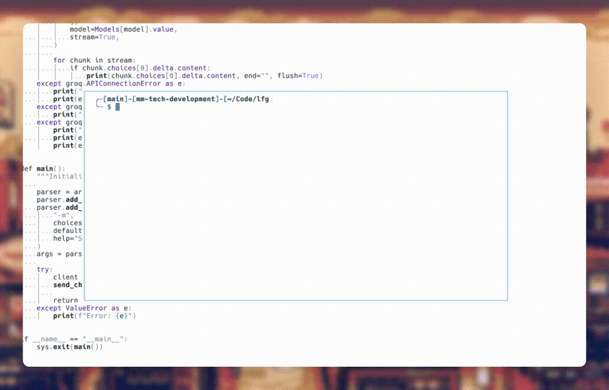

# LFG

> LFG, It Really Whips the Llama's Ass 🦙🦙🦙🦙



LFG is a command-line tool that intelligently helps you find the right terminal commands for your tasks. Such sales pitch.

And this is a PowerShell port just for the fun of it!

## Why?

Similar to the original lfg author I was looking for a way to play with these models to see what they can do and how they can be useful. Using this service for free (for now) gives you a quick tool to look up commands and getting scripting assitance in your console.

## Installation

```powershell
# Import Module
Import-Module -Name C:\Path\To\LFG.PS

# Set API Key
Set-GroqApiKey "gsk_yourgroqapikey"

```

## Usage

This executable is using Groq, that means you need and [API token](https://console.groq.com/keys).

Groq is having a free beta, for now.

Add the token to your .bashrc/.zshrc and reload your terminal.

```
PS> lfg [-Model {llama38b,llama370b,mixtral8x7b,gemma7b}] [-ApiKey "gsk_yourgroqapikey"] query
```

```powershell
PS> lfg "show all open ports"

Get-NetTCPConnection | Where-Object { $_.State -eq "Listen" } | Select-Object LocalPort, RemoteAddress, RemotePort, State, OwningProcess

```

Change the LLM 
```powershell 
PS> lfg -Model llama370b "view all Azure resource groups and their resources"

Get-AzResourceGroup | ForEach-Object {Write-Host " Resource Group: $($_.ResourceGroupName)"; Get-AzResource -ResourceGroupName $_.ResourceGroupName}

```

### TODO

- Maybe add a publishing option?
